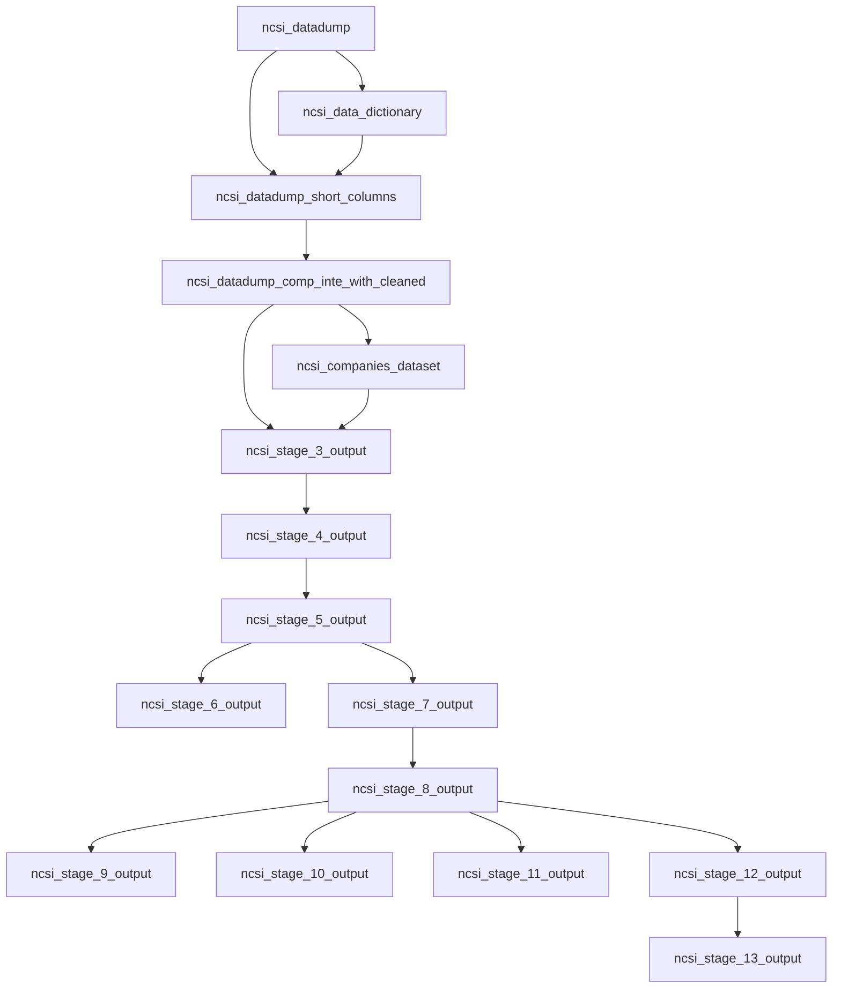

# Dagster NCSI Pipeline

This project defines a Dagster asset pipeline that transforms NCSI survey data across 13 cleaning/enrichment stages and writes CSV outputs per stage.

## Pipeline Graph



## Stage Outputs

1. Stage 1
    - datasets/clean_stage1/stage_1_ouput.csv
    - datasets/clean_stage1/stage_1_data_dictionary.csv
2. Stage 2
    - datasets/clean_stage2/stage_2_ouput.csv
3. Stage 3
    - datasets/clean_stage3/companies_dataset.csv
    - datasets/clean_stage3/stage_3_ouput.csv
4. Stage 4
    - datasets/clean_stage4/stage_4_ouput.csv
5. Stage 5
    - datasets/clean_stage5/stage_5_ouput.csv
6. Stage 6
    - datasets/clean_stage6/stage_6_ouput.csv
7. Stage 7
    - datasets/clean_stage7/stage_7_output.csv
8. Stage 8
    - datasets/clean_stage8/stage_8_output.csv
9. Stage 9
    - datasets/clean_stage9/stage_9_output.csv
10. Stage 10
    - datasets/clean_stage10/stage_10_output.csv
11. Stage 11
    - datasets/clean_stage11/stage_11_output.csv
12. Stage 12
    - datasets/clean_stage12/stage_12_output.csv
13. Stage 13
    - datasets/clean_stage13/stage_13_output.csv

## What Each Stage Does

1. Stage 1
    - Builds shortened column names.
    - Generates a data dictionary mapping short_name to original_name.
2. Stage 2
    - Drops rows where comp_inte_with is null.
    - Normalizes comp_inte_with to uppercase.
3. Stage 3
    - Extracts unique companies from comp_inte_with.
    - Creates company_id values.
    - Adds company_id back to the row-level dataset.
4. Stage 4
    - Uses CardiffNLP Twitter-RoBERTa sentiment model on impr_on_cust.
    - Appends impr_on_cust_sentiment column.
5. Stage 5
    - Uses like_to_reco.
    - Appends nps_category with: promoter, passive, detractor.
6. Stage 6
    - Splits comma-separated chan_of_inte values into row-level entries.
    - Produces a two-column output keyed by i and chan_of_inte.
7. Stage 7
    - Maps ag values into broad age categories.
    - Appends age_category column.
8. Stage 8
    - Maps inco values into socioeconomic categories.
    - Appends income_category column.
9. Stage 9
    - Converts selected base-7 and base-8 survey metrics to percentages.
10. Stage 10
    - Aggregates average order-of-importance scores per company and attribute.
11. Stage 11
    - Computes company-level NPS stats: responses, promoters, detractors, passives, nps_score.
12. Stage 12
    - Aggregates response counts per regi into State/Count output.
13. Stage 13
    - Runs after Stage 12 while using Stage 9 output as input.
    - Calculates overall_cx_score using weighted attribute scores per company.
    - Outputs company_id, sector, and overall_cx_score.

## Running Locally

```powershell
python -m venv .venv
.\.venv\Scripts\Activate.ps1
pip install -r requirements.txt
pip install -e .
dagster dev
```

Dagster UI runs at http://127.0.0.1:3000.

## Materialize Assets via Python

```powershell
python -c "from data_quality_checker import defs; from dagster import materialize; materialize(defs.assets)"
```

## Tests

The test suite uses Python's built-in unittest framework (tests are in tests/test_quality.py).

Run from the repository root:

```powershell
cd Dagster
python -m unittest discover -s tests -p "test_*.py" -v
```

If you are already inside the Dagster folder, run only:

```powershell
python -m unittest discover -s tests -p "test_*.py" -v
```

All tests must pass before you push.

Current test coverage includes Stage 1 through Stage 12 transformations.

## Architecture Notes

1. CSV read/write is abstracted in data_quality_checker/io_managers.py.
2. All assets are loaded in data_quality_checker/__init__.py.
3. The job selection is "*" in data_quality_checker/schedules.py and is scheduled hourly.
