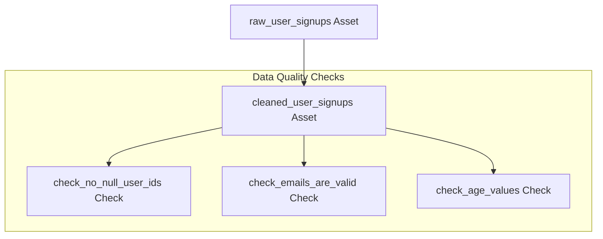

# Dagster Data Quality Standards Verification Project

This project implements an automated, schedule-driven **Data Quality Verification** pipeline using **Dagster**. It simulates a production-ready system that cleans incoming raw user data and runs inline checks to ensure the processed data meets strict business and schema requirements.



---

## Key Features

1.  **Software-Defined Assets (SDAs):** The pipeline models data inputs and outputs as explicit assets (`raw_user_signups` and `cleaned_user_signups`).
2.  **Asset Checks:** Native data quality assertions defined alongside the data pipeline to flag anomalies with custom metadata and varying severities (e.g., `WARN` vs. `ERROR`).
3.  **Hourly Schedules:** Automatic execution of jobs to check standards at regular intervals.
4.  **Interactive Web UI:** Visual lineage visualization, run monitoring, scheduling control, and historical data quality tracking.

---

## Project Structure

```text
D:\Work\Dagster\
├── .venv/                         # Local Python virtual environment
├── requirements.txt               # Project dependency list
├── pyproject.toml                 # Configures data_quality_checker as the default Dagster module
├── setup.py                       # Packaging setup file
├── setup.cfg                      # Package metadata configuration
└── data_quality_checker/          # Core Dagster Python Package
    ├── __init__.py                # Main entry point loading all definitions
    ├── assets.py                  # Assets and Asset Quality Checks logic
    └── schedules.py               # Schedule definitions and jobs
```

---

## Installation & Setup

Follow these steps to set up and run the project locally on Windows:

### 1. Prerequisites
Ensure you have **Python 3.10+** installed on your system.

### 2. Create and Activate Virtual Environment
Open PowerShell or Command Prompt in the `d:/Work/Dagster` directory:
```powershell
# Create a virtual environment
python -m venv .venv

# Activate the virtual environment
# In PowerShell:
.\.venv\Scripts\Activate.ps1
# In CMD:
.\.venv\Scripts\activate.bat
```

### 3. Install Dependencies
Install the required packages in editable mode:
```powershell
pip install -e .
```

---

## Code Overview

### 1. Software-Defined Assets ([assets.py](file:///d:/Work/Dagster/data_quality_checker/assets.py))
We define two assets:
*   `raw_user_signups`: Loads mock raw user registrations containing missing IDs, invalid emails, and incorrect negative ages.
*   `cleaned_user_signups`: Downstream asset that cleans raw inputs by purging missing IDs/emails, correcting ages, and standardizing country strings.

### 2. Standards Verification (Asset Checks)
Three data quality gates are attached to `cleaned_user_signups`:
1.  `check_no_null_user_ids` (`ERROR`): Verifies no records contain missing user IDs.
2.  `check_emails_are_valid` (`ERROR`): Confirms all email addresses are format-compliant (contain `@`).
3.  `check_age_values` (`WARN`): Assures there are no negative ages.

### 3. Schedules & Jobs ([schedules.py](file:///d:/Work/Dagster/data_quality_checker/schedules.py))
We define a job `standards_verification_job` which executes materialization of both assets (including checks). This is tied to `hourly_verification_schedule`, which automatically executes the pipeline every hour (`0 * * * *`).

---

## Running the Project

### 1. Starting the Dagster UI
To start the Dagster UI web server locally, run:
```powershell
dagster dev
```
By default, the server will launch on [http://127.0.0.1:3000](http://127.0.0.1:3000). 
Open your web browser and navigate to this URL to view the lineage graphs and logs.

### 2. Running Programmatic Tests
To execute the pipeline and inspect verification results directly via Python:
```powershell
python -c "from data_quality_checker import defs; from dagster import materialize; materialize(list(defs.assets) + list(defs.asset_checks))"
```

> [!TIP]
> A custom programmatic testing script is provided in the conversation context at:
> [verify_checks.py](file:///C:/Users/15406/.gemini/antigravity-ide/brain/a863cdf6-2b64-4a48-ba0a-64a644a59da9/scratch/verify_checks.py).
> You can run it with `python verify_checks.py` to view detailed formatting of check evaluations.

---

## Deploying Dagster "Online" (Production Guide)

To run Dagster continuously in a production environment:

### 1. Set Up `DAGSTER_HOME`
By default, `dagster dev` uses a temporary directory for runs and event records. For production, set the `DAGSTER_HOME` environment variable to a persistent directory:
```powershell
[System.Environment]::SetEnvironmentVariable("DAGSTER_HOME", "D:\Work\Dagster\dagster_home", "Machine")
```
Initialize a `dagster.yaml` file in `DAGSTER_HOME` to configure a permanent DB backend (like PostgreSQL) and run coordination.

### 2. Run Daemon as a Service
In production, schedules and sensors require the **Dagster Daemon** to be running constantly in the background to poll and trigger runs.
Run the daemon alongside your webserver:
```powershell
dagster-daemon run
```
On Windows, you can wrap `dagster-daemon run` and `dagster-webserver` as Windows Services using utilities like NSSM (Non-Sucking Service Manager).

### 3. Containerization (Docker Setup)
For cloud deployment, wrap your code in a Docker image using a base `python:3.12-slim` image and run your code locations, daemon, and server in separate containers.
