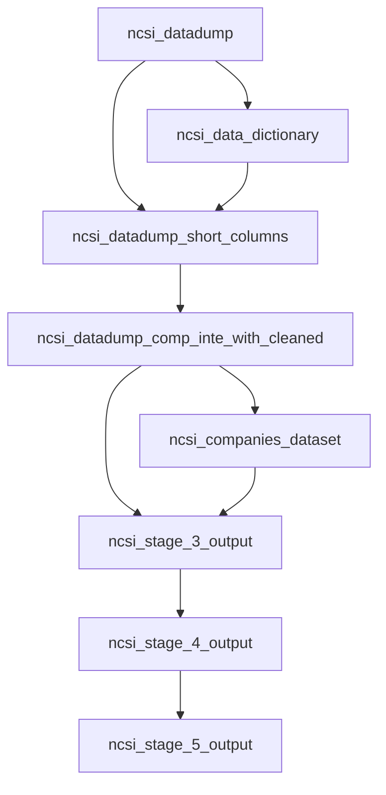

# Dagster NCSI Pipeline

This project defines a Dagster asset pipeline that transforms NCSI survey data across 5 cleaning/enrichment stages and writes CSV outputs per stage.

## Pipeline Graph



## Stage Outputs

1. Stage 1
    - datasets/clean_stage1/stage_1_ouput.csv
    - datasets/clean_stage1/stage_1_data_dictionary.csv
2. Stage 2
    - datasets/clean_stage2/stage_2_ouput.csv
3. Stage 3
    - datasets/clean_stage3/companies_dataset.csv
    - datasets/clean_stage3/stage_3_ouput.csv
4. Stage 4
    - datasets/clean_stage4/stage_4_ouput.csv
5. Stage 5
    - datasets/clean_stage5/stage_5_ouput.csv

## What Each Stage Does

1. Stage 1
    - Builds shortened column names.
    - Generates a data dictionary mapping short_name to original_name.
2. Stage 2
    - Drops rows where comp_inte_with is null.
    - Normalizes comp_inte_with to uppercase.
3. Stage 3
    - Extracts unique companies from comp_inte_with.
    - Creates company_id values.
    - Adds company_id back to the row-level dataset.
4. Stage 4
    - Uses TextBlob on impr_on_cust.
    - Appends impr_on_cust_sentiment column.
5. Stage 5
    - Uses like_to_reco.
    - Appends nps_category with: promoter, passive, detractor.

## Running Locally

```powershell
python -m venv .venv
.\.venv\Scripts\Activate.ps1
pip install -r requirements.txt
pip install -e .
dagster dev
```

Dagster UI runs at http://127.0.0.1:3000.

## Materialize Assets via Python

```powershell
python -c "from data_quality_checker import defs; from dagster import materialize; materialize(defs.assets)"
```

## Tests

Run:

```powershell
cd Dagster
python -m unittest discover -s tests
```

All tests must pass before you push.

Current test coverage includes Stage 1 through Stage 5 transformations.

## Architecture Notes

1. CSV read/write is abstracted in data_quality_checker/io_managers.py.
2. All assets are loaded in data_quality_checker/__init__.py.
3. The job selection is "*" in data_quality_checker/schedules.py and is scheduled hourly.
