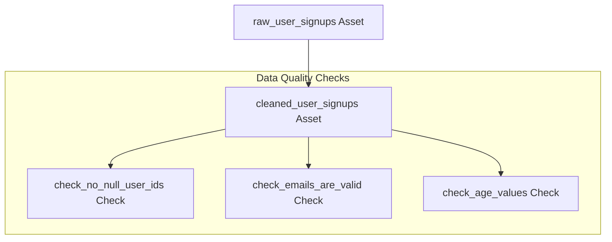

# Dagster Projects Workspace

This workspace contains two distinct Dagster projects:

1. **Dagster Data Quality Standards Verification Project** (Located at the root of the workspace)
2. **Dagster NCSI Data Cleaning Pipeline** (Located in the `Dagster/` subdirectory)

---

## 1. Dagster Data Quality Standards Verification Project (Root)

This project implements an automated, schedule-driven **Data Quality Verification** pipeline using **Dagster**. It simulates a production-ready system that cleans incoming raw user data and runs inline checks to ensure the processed data meets strict business and schema requirements.



### Key Features

1. **Software-Defined Assets (SDAs):** The pipeline models data inputs and outputs as explicit assets (`raw_user_signups` and `cleaned_user_signups`).
2. **Asset Checks:** Native data quality assertions defined alongside the data pipeline to flag anomalies with custom metadata and varying severities (e.g., `WARN` vs. `ERROR`).
3. **Hourly Schedules:** Automatic execution of jobs to check standards at regular intervals.
4. **Interactive Web UI:** Visual lineage visualization, run monitoring, scheduling control, and historical data quality tracking.

### Project Structure (Root)

```text
D:\Work\Dagster\
├── .venv/                         # Local Python virtual environment
├── requirements.txt               # Project dependency list
├── pyproject.toml                 # Configures data_quality_checker as the default Dagster module
├── setup.py                       # Packaging setup file
├── setup.cfg                      # Package metadata configuration
└── data_quality_checker/          # Core Dagster Python Package
    ├── __init__.py                # Main entry point loading all definitions
    ├── assets.py                  # Assets and Asset Quality Checks logic
    └── schedules.py               # Schedule definitions and jobs
```

### Installation & Setup (Root)

Ensure you have **Python 3.10+** installed.
Open PowerShell in the `d:/Work/Dagster` directory:
```powershell
python -m venv .venv
.\.venv\Scripts\Activate.ps1
pip install -e .
```

### Running the Project (Root)

#### Starting the Dagster UI
```powershell
dagster dev
```
Open [http://127.0.0.1:3000](http://127.0.0.1:3000).

#### Running Programmatic Tests
```powershell
python -c "from data_quality_checker import defs; from dagster import materialize; materialize(list(defs.assets) + list(defs.asset_checks))"
```

---

## 2. Dagster NCSI Data Cleaning Pipeline (Subdirectory)

This project transforms an NCSI CSV datadump through a 5-stage cleaning and enrichment pipeline.

### Overview

The project reads source data from `Dagster/datasets/datadump.csv` and materializes staged outputs to dedicated folders under `Dagster/datasets/clean_stage*/`.

Pipeline stages:
1. Stage 1: shorten source column names and generate a data dictionary.
2. Stage 2: clean comp_inte_with (drop nulls, uppercase values).
3. Stage 3: build companies dataset and attach company IDs to each row.
4. Stage 4: analyze sentiment from impr_on_cust using TextBlob.
5. Stage 5: derive NPS category from like_to_reco.

### Project Structure (Subdirectory)

```text
Dagster/
├── README.md
├── pyproject.toml
├── requirements.txt
├── data_quality_checker/
│   ├── __init__.py
│   ├── assets.py
│   ├── io_managers.py
│   └── schedules.py
├── datasets/
│   ├── datadump.csv
│   ├── clean_stage1/
│   │   ├── stage_1_ouput.csv
│   │   └── stage_1_data_dictionary.csv
│   ├── clean_stage2/
│   │   └── stage_2_ouput.csv
│   ├── clean_stage3/
│   │   ├── companies_dataset.csv
│   │   └── stage_3_ouput.csv
│   ├── clean_stage4/
│   │   └── stage_4_ouput.csv
│   └── clean_stage5/
│       └── stage_5_ouput.csv
└── tests/
    └── test_column_shortening.py
```

### Local Setup (Subdirectory)

1. Navigate to the `Dagster` folder:
```powershell
cd Dagster
python -m venv .venv
.\.venv\Scripts\Activate.ps1
pip install -r requirements.txt
pip install -e .
```

2. Run Dagster UI:
```powershell
dagster dev
```
Open [http://127.0.0.1:3000](http://127.0.0.1:3000).

### Running the Pipeline (Subdirectory)

Materialize all assets:
```powershell
python -c "from data_quality_checker import defs; from dagster import materialize; materialize(defs.assets)"
```

### Running Tests (Subdirectory)
```powershell
cd Dagster
python -m unittest discover -s tests
```

All tests must pass before you push.
